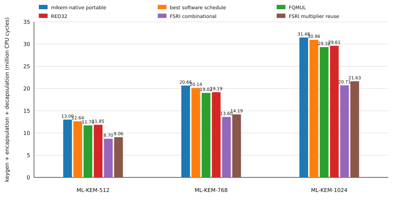
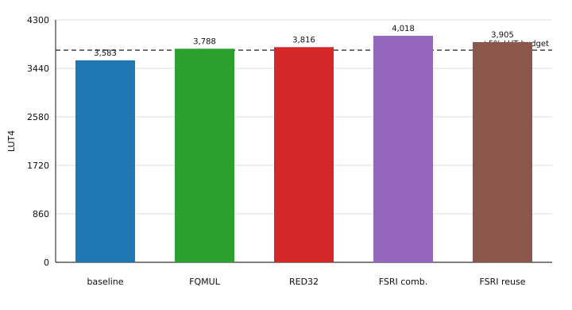
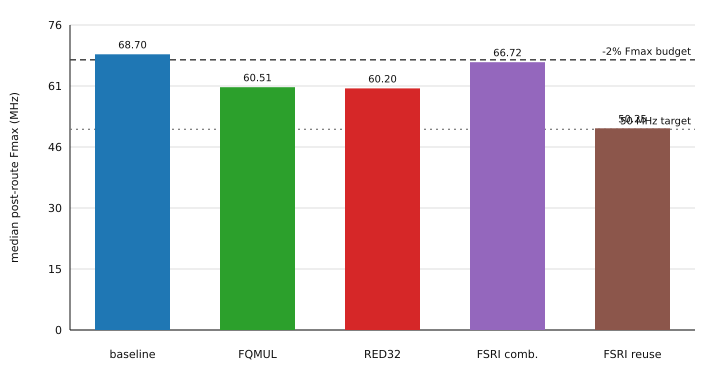

# ML-KEM software and custom RISC-V instructions on PicoRV32

This repository evaluates ML-KEM software schedules and custom RISC-V instructions on a small RV32 PicoRV32 core. The ML-KEM implementation is a pinned `mlkem-native` revision. Every target variant is compiled as bare-metal RV32IMC firmware, executed on PicoRV32 RTL with Verilator, and synthesized and routed for an ECP5 FPGA.

The question is deliberately narrow:

> Can one custom instruction beat tuned software while staying inside a strict hardware budget?

The hardware budget is **at most +5% LUT4, +5% flip-flops, -2% median Fmax, no extra DSP or BRAM, with all five routing seeds meeting 50 MHz**.

## Results

A CPU cycle is one processor clock tick. At the 50 MHz test clock, one cycle is 20 ns. The **portable baseline** is the pinned `mlkem-native` portable arithmetic path. The **best software schedule** is the fastest of 24 legal schedules using only standard RISC-V instructions.

The table reports key generation + encapsulation + decapsulation. Percentages are reductions relative to the portable baseline.

| parameter set | portable baseline | best software | FQMUL | RED32 | FSRI combinational | FSRI multiplier reuse |
|---|---:|---:|---:|---:|---:|---:|
| ML-KEM-512 | 13,004,560 | 12,636,735 (-2.83%) | 11,703,506 (-10.00%) | 11,847,177 (-8.90%) | **8,700,799 (-33.09%)** | 9,055,759 (-30.36%) |
| ML-KEM-768 | 20,658,560 | 20,143,356 (-2.49%) | 19,023,552 (-7.91%) | 19,187,466 (-7.12%) | **13,604,448 (-34.15%)** | 14,189,088 (-31.32%) |
| ML-KEM-1024 | 31,479,592 | 30,964,081 (-1.64%) | 29,318,051 (-6.87%) | 29,614,042 (-5.93%) | **20,711,107 (-34.21%)** | 21,634,003 (-31.28%) |



The polynomial instructions help, but only modestly after software scheduling. FQMUL reduces cycles by 5.32-7.39% relative to tuned software; RED32 reduces them by 4.36-6.25%.

FSRI is different. Two FSRIs replace one 64-bit Keccak rotation on RV32. The combinational implementation reduces end-to-end cycles by **31.15-33.11% relative to tuned software**. A slower multiplier-reuse implementation still retains about 91% of that gain.

The large FSRI result was checked against retired instruction counts and disassembly: the reduction is caused by replacing expensive RV32 lowering of 64-bit Keccak rotations, not by a benchmark-counter artifact.

### FPGA cost

`LUT4` counts FPGA logic. Flip-flops count stored state. DSP counts dedicated arithmetic blocks. `Fmax` is the maximum routed clock frequency estimated by nextpnr. Higher Fmax is better.

| design | LUT4 | flip-flops | DSP | BRAM | median Fmax | 50 MHz seeds | full budget |
|---|---:|---:|---:|---:|---:|---:|:---:|
| baseline PicoRV32 | 3,583 | 970 | 4 | 0 | 68.70 MHz | 5/5 | — |
| FQMUL | 3,788 (+5.72%) | 1,053 (+8.56%) | 4 | 0 | 60.51 MHz (-11.92%) | 5/5 | no |
| RED32 | 3,816 (+6.50%) | 1,053 (+8.56%) | 4 | 0 | 60.20 MHz (-12.37%) | 5/5 | no |
| FSRI combinational | 4,018 (+12.14%) | 970 (+0.00%) | 4 | 0 | 66.72 MHz (-2.88%) | 5/5 | no |
| FSRI multiplier reuse | 3,905 (+8.99%) | 1,037 (+6.91%) | 4 | 0 | 50.25 MHz (-26.86%) | 3/5 | no |





The conclusion under the original constraint is simple: **none of the tested custom instructions meets the complete hardware budget**.

The combinational FSRI is the strongest performance result and preserves timing well, but its +12.14% LUT cost is too high. Reusing the existing multiplier reduces FSRI area somewhat, but still misses the LUT and flip-flop limits and severely damages timing. FQMUL and RED32 are smaller extensions, but both also cross the area and timing limits.

The final machine-readable numbers are in [`results/summary.json`](results/summary.json).

## Software schedule search

ML-KEM polynomial arithmetic can use the same mathematical operations with different schedules and reduction points. Each parameter set tests:

| part | choices |
|---|---|
| forward NTT | one layer at a time, fuse two layers |
| inverse NTT | one layer at a time, fuse two layers |
| inverse reduction | reduce every layer, reduce after each layer pair |
| base multiplication | cached late, cached eager, direct eager |

This gives 24 standard-instruction schedules per parameter set. The best no-extension schedule for ML-KEM-512, ML-KEM-768, and ML-KEM-1024 is `ffuse2_ifuse2_rpair_bcachelate`.

Keeping this tuned software result separate from the portable baseline matters: it prevents a custom instruction from receiving credit for improvements available through software scheduling alone.

## Custom instructions

All custom instructions are connected through PicoRV32's Pico Co-Processor Interface (PCPI).

### FQMUL

FQMUL fuses a signed 16x16 multiply with the Montgomery reduction used by ML-KEM:

```text
a = sign16(rs1)
b = sign16(rs2)
t = a * b
u = sign16((low16(t) * 62209) mod 2^16)
rd = (t - u * 3329) / 2^16
```

It targets polynomial arithmetic. The implementation and RED32 share the main custom-instruction datapath in [`targets/picorv32/rtl/pqc_pcpi_mlkem.sv`](targets/picorv32/rtl/pqc_pcpi_mlkem.sv).

### RED32

RED32 separates multiplication from reduction:

```text
t = sign32(rs1)
u = sign16((low16(t) * 62209) mod 2^16)
rd = (t - u * 3329) / 2^16
```

An ML-KEM multiplication therefore executes a standard `MUL` followed by RED32. This tests whether keeping multiplication in the existing RISC-V M path produces a better hardware tradeoff than FQMUL.

### FSRI

FSRI is a funnel-shift-right-immediate operation:

```text
fsri rd, rs1, rs2, shamt
rd = low32(({rs2, rs1} >> shamt))
```

Swapping the two source registers produces the other 32-bit half required for a 64-bit rotate, so each Keccak rotation uses two instructions.

The instruction concept is not new: it is a restricted project-local adaptation of the earlier RISC-V Bitmanip funnel-shift proposal. The new result here is the measured ML-KEM/PicoRV32 tradeoff, not the invention of FSRI itself.

Two hardware implementations were measured:

- **combinational FSRI** — a direct funnel network; fastest, +12.14% LUT4
- **multiplier-reuse FSRI** — uses power-of-two multiplication to avoid a second funnel network; slower and somewhat smaller, but with poor timing

The current RTL contains the multiplier-reuse implementation. The combinational numbers are preserved in `results/summary.json` and correspond to commit `1b1d01aaaffe48a0bfff3cdc096cca526f8a40ca`.

## Testing

Verilator executes the processor RTL cycle by cycle; the reported performance numbers are processor-cycle counts, not host wall-clock timings.

The repository checks the implementation at several levels:

| check | coverage |
|---|---|
| host unit tests | schedule enumeration, code generation, arithmetic helpers, result parsing |
| full ML-KEM runs | key generation, encapsulation, decapsulation, shared-secret correctness |
| direct PCPI RTL tests | arithmetic, fixed latency, reset, back-to-back requests, decode isolation |
| five-seed ECP5 flow | LUT4, flip-flops, DSP, BRAM, routed Fmax |
| targeted FSRI formal | bounded PCPI semantics/handshake and bounded PicoRV32 RVFI retirement harness |

The direct targeted FSRI PCPI BMC passes. The RVFI harness is intentionally small; its latest reset-gating fix should be rerun before claiming a final RVFI PASS.

This is an RTL/FPGA study. It does not claim physical-board timing or physical side-channel resistance.

## Important files

- [`targets/picorv32/rtl/pqc_pcpi_mlkem.sv`](targets/picorv32/rtl/pqc_pcpi_mlkem.sv) — custom instruction datapath and PCPI state machine
- [`targets/picorv32/rtl/pqc_picorv32_core_top.sv`](targets/picorv32/rtl/pqc_picorv32_core_top.sv) — PicoRV32 integration
- [`targets/picorv32/mlkem/`](targets/picorv32/mlkem/) — C models and inline instruction wrappers
- [`targets/picorv32/firmware/mlkem_bench.c`](targets/picorv32/firmware/mlkem_bench.c) — end-to-end ML-KEM benchmark
- [`targets/picorv32/formal/fsri.sby`](targets/picorv32/formal/fsri.sby) — targeted FSRI formal tasks
- [`results/summary.json`](results/summary.json) — compact final result set

The remaining source files support code generation, target execution, synthesis, verification, and reproducibility.

## Reproduce

Normal host tests:

```bash
cmake --preset release
cmake --build --preset release --parallel
ctest --preset release --output-on-failure
```

The target experiments use:

| tool | release |
|---|---|
| RISC-V GNU toolchain | 2026.07.15 |
| OSS CAD Suite | 2026-07-29 |

PicoRV32 is pinned at `a473fc8fca393771d83b0ffcf0b14db3393339d8` and `mlkem-native` at `69d24e37b8a04c6050ec55bc84a4228d7051bb4b`.

Configure the target build:

```bash
cmake -S . -B build/picorv32 -G Ninja \
  -DCMAKE_BUILD_TYPE=Release \
  -DPQC_POLY_LTO=OFF \
  -DPQC_POLY_PICORV32_MLKEM=ON \
  -DPQC_POLY_PICORV32_SYNTHESIS=ON
```

Run the software schedules and custom-instruction experiments:

```bash
cmake --build build/picorv32 --parallel 8 \
  --target pqc-picorv32-mlkem pqc-picorv32-fqmul pqc-picorv32-red32 pqc-picorv32-fsri
```

Synthesis targets are:

```text
pqc-picorv32-fqmul-synthesis
pqc-picorv32-red32-synthesis
pqc-picorv32-fsri-synthesis
```

The multiplier-reuse FSRI synthesis target intentionally returns nonzero if any seed misses 50 MHz; the synthesis JSON is still written.

Targeted FSRI formal:

```bash
targets/picorv32/formal/fsri.sh build/picorv32
```

## References

- NIST, [FIPS 203: ML-KEM](https://doi.org/10.6028/NIST.FIPS.203)
- [`mlkem-native`](https://github.com/pq-code-package/mlkem-native)
- PicoRV32 and PCPI, [`YosysHQ/picorv32`](https://github.com/YosysHQ/picorv32)
- E. Alkim, H. Evkan, N. Lahr, R. Niederhagen, R. Petri, [ISA Extensions for Finite Field Arithmetic: Accelerating Kyber and NewHope on RISC-V](https://doi.org/10.13154/TCHES.V2020.I3.219-242)
- RISC-V Bitmanip v0.93 funnel-shift specification, [`bext.tex`](https://github.com/riscv/riscv-bitmanip/blob/v0.93/texsrc/bext.tex)
